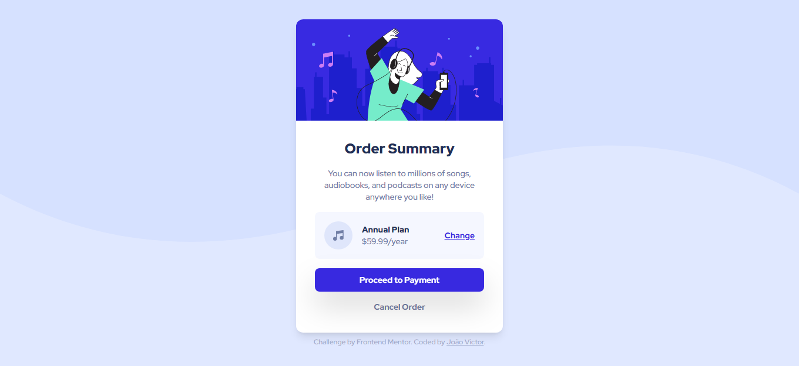

# Frontend Mentor - solução de componente de código QR


## Bem Vindo! 👋

Olá! 👋 Meu nome é João Victor, e sou apaixonado por tecnologia e inovação.

🤝 Habilidades Sociais
Sou uma pessoa objetiva, comunicativa, determinada e organizada, e tenho habilidades em resolver conflitos. Como desenvolvedor, acredito que a comunicação e habilidades interpessoais são tão importantes quanto habilidades técnicas.

💻 Habilidades Técnicas
Além disso, tenho experiência em desenvolvimento web e análise de dados, e posso trabalhar com linguagens como Python, Javascript, React e Next.js. Também possuo conhecimentos em HTML e CSS, que são as bases fundamentais para criar interfaces de usuário atraentes e intuitivas.

📈 Aprendizado Contínuo
Estou constantemente procurando expandir minhas habilidades e, no momento, estou aprendendo Power BI e plataformas de low-code. Atualmente, estou cursando uma pós-graduação em MBA em Ciência de Dados, e estou muito animado para aplicar minhas habilidades técnicas e conhecimentos em tecnologia para criar soluções inovadoras que possam transformar o mundo.

## Índice

- [Overview](#overview)
  - [Screenshot](#screenshot)
  - [Links](#links)
- [Meu processo](#meu-processo)
  - [Construído com](#construído-com)
  - [O que eu aprendi](#o-que-eu-aprendi)
  - [Desenvolvimento contínuo](#desenvolvimento-contínuo)
- [Autor](#autor)

## Overview

### Screenshot



### Links

- URL da solução: [https://github.com/shufito/desafio_01_qr_code_frontend_mentor](https://github.com/shufito/desafio_03_order-summary)
- URL do site ao vivo: [https://shufito.github.io/desafio_01_qr_code_frontend_mentor/](https://shufito.github.io/desafio_03_order-summary/)

## Meu processo

### Construído com

- HTML5
- CSS3
- Flexbox
- [Tailwindcss](https://tailwindcss.com/) - TailWindCss

### O que eu aprendi

Com esse desafio, aprendi a utilizar o conceito de mídia queries para aplicar estilos diferentes com base no tamanho da tela. No código CSS que compartilhei, utilizei a classe .bg-switch para alterar a imagem de fundo dependendo da largura da tela:

```css
    .bg-switch {
    background-image: url("./images/pattern-background-mobile.svg");
    }
    @media screen and (min-width: 376px) {
    .bg-switch {
        background-image: url("./images/pattern-background-desktop.svg");
    }
    }
```

No CSS acima, defini uma imagem de fundo usando background-image com a URL do arquivo pattern-background-mobile.svg. Essa imagem será exibida como plano de fundo para telas menores ou iguais a 375 pixels de largura.

Em seguida, utilizei a regra de mídia @media screen and (min-width: 376px) para especificar um estilo diferente para telas com largura maior ou igual a 376 pixels. Dentro dessa regra de mídia, redefinei a classe .bg-switch com a URL do arquivo pattern-background-desktop.svg. Isso substitui o estilo anterior e define a nova imagem de fundo para telas maiores.

Essa técnica me permitiu adaptar o layout e os estilos da minha página de acordo com o tamanho da tela, proporcionando uma experiência responsiva para os usuários.

### Desenvolvimento contínuo

Pretendo continuar aprendendo Tailwind para aprimorar minhas habilidades de desenvolvimento web e criar interfaces de usuário eficientes e responsivas. Com essa ferramenta, posso explorar uma abordagem utility-first para estilizar meus elementos, facilitando a construção rápida de layouts complexos e personalizados. Além disso, quero me aprofundar nas funcionalidades avançadas, como a criação de componentes reutilizáveis e a otimização do desempenho do site. Acredito que dominar essa técnica me tornará um desenvolvedor mais produtivo, capaz de criar projetos web modernos com código limpo e sustentável.

## Autor

- Website - [João Victor](https://shufito.github.io/)
- Frontend Mentor - [@shufito](https://www.frontendmentor.io/profile/shufito)
- linkedin: [João Victor](https://www.linkedin.com/in/jo%C3%A3o-victor-silva-profissional/)
- GitHub: [https://github.com/shufito](https://github.com/shufito)
